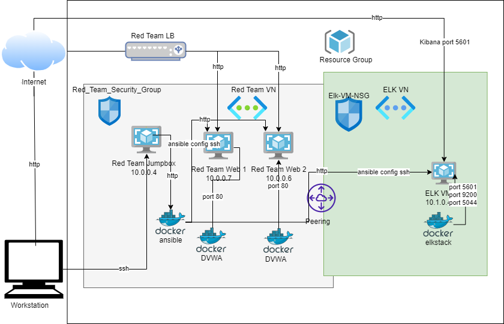

## Automated ELK Stack Deployment

The files in this repository were used to configure the network depicted below.

These files have been tested and used to generate a live ELK deployment on Azure. They can be used to either recreate the entire deployment pictured above. 

Alternatively, select portions of the playbook file may be used to install only certain pieces of it, such as Filebeat.

install-elk.yml
filebeat-playbook.yml
metricbeat-playbook.yml

This document contains the following details:
- Description of the Topology
- Access Policies
- ELK Configuration
  - Beats in Use
  - Machines Being Monitored
- How to Use the Ansible Build

### Description of the Topology

The main purpose of this network is to expose a load-balanced and monitored instance of DVWA, the D*mn Vulnerable Web Application.

Load balancing ensures that the application will be highly available, in addition to restricting access to the network.

The load balancer restricts high traffic and ensures functionality. It helps prevent overloading servers as well as optimizes productivity and maximizes uptime.
It adds resiliency by rerouting live traffic from one server to another causing it to eliminate single points of failure from attacks such as DDoS attack.

Jump boxes are highly secured computers that are primarily used for admin tasks only. They are comprehensive/lock-down secure admin workstations so as to decrease the
chances of hackers/malware infection.

Integrating an ELK server allows users to easily monitor the vulnerable VMs for changes to the log files and to monitor system resources

- Filebeat monitors log files
- Metricbeat collects and transports system metrics

The configuration details of each machine may be found below.

| Name             | Function| Priv IP//Public IP      | Operating System |
|------------------|---------|------------------------ |------------------|
| Red-Team-Jumpbox | Gateway | 10.0.0.4//137.117.22.72 | Linux            |
| Red-Team-Web1    | Server  | 10.0.0.7                | Linux            |
| Red-Team-Web2    | Server  | 10.0.0.6                | Linux            |
| ELK-VM           | Server  | 10.1.0.4//20.120.14.143 | Linux            |

### Access Policies

The machines on the internal network are not exposed to the public Internet. 

Only the Red-Team-Jumpbox machine can accept connections from the Internet. Access to this machine is only allowed from the following IP addresses:
- 76.99.252.XXX

Machines within the network can only be accessed by Red-Team-Jumpbox.

The machine below has access to the ELK VM
Red-Team-Jumpbox
Private IP: 10.0.0.4 

A summary of the access policies in place can be found in the table below.

| Name             | Publicly Accessible | Allowed IP Addresses |
|------------------|---------------------|----------------------|
| Red-Team-Jumpbox | Yes                 | 76.99.252.190        |
| Red-Team-Web1    | No                  | 10.0.0.4             |
| Red-Team-Web2    | No                  | 10.0.0.4             |
| ELK-VM           | No                  | 10.0.0.4             |

### Elk Configuration

Ansible was used to automate configuration of the ELK machine. No configuration was performed manually, which is advantageous because this provides the ability to configure machines in a consistent, repeatable, and scalable way reducing the chances of errors.

The playbook implements the following tasks:
Install ELK
- Installs Docker
- Installs Python-pip3
- Installs the docker module
- Configures the target machine to use more memory
- Downloads and launches Docker container for the ELK Stack sebp/elk:761

Install Filebeat Playbook
-Download and install Filebeat
-Copy Filebeat configuration
-Enable Filebeat system module
-Setup Filebeat
-Start and enable Filebeat service

Install Metricbeat Playbook
-Download and install Metricbeat
-Copy Metricbeat configuration
-Enable Metricbeat docker module
-Setup Metricbeat
-Start and enable Metricbeat service

-The following screenshot displays the result of running `docker ps` after successfully configuring the ELK instance.

### Target Machines & Beats
This ELK server is configured to monitor the following machines:

| Red-Team-Web1    | Web Server          | 10.0.0.7
| Red-Team-Web2    | Web Server          | 10.0.0.6 

We have installed the following Beats on these machines:
- Filebeat
- MetricBeat

These Beats allow us to collect the following information from each machine:

- Filebeat collects system logs, allowing us to view a variety of information, including successful and failed login attempts, failed processes, errors that occur in running processes, etc

-Metricbeat collects metric information on each system, allowing us to view CPU load, network I/O, CPU usage, and memory pressure, among other thing

### Using the Playbook
In order to use the playbook, you will need to have an Ansible control node already configured. Assuming you have such a control node provisioned: 

SSH into the control node and follow the steps below:

- Copy the three playbooks install-elk.yml, metricbeat-playbook.yml, and filebeat-playbook.yml file to /etc/ansible/roles/ on the control node.

-Update the hosts file to include your destination IPs of the ELk and webservers groups.

-Run the playbook, and navigate to http://20.120.14.143:5601/app/kibana to check that the installation worked as expected.

Groups in the host file specify which machines to install file beat versus elk on. The group for File beat is webservers, the elk group is ELK.

Specific Commands Bonus

# Ensure the destination directories exist
$ mkdir -p /etc/ansible/roles/files

# Copy the playbooks to the expected locations
$ cp CSBC-Elk-Stack/ansible/roles/install-elk.yml /etc/ansible/roles
$ cp CSBC-Elk-Stack/ansible/roles/filebeat-playbook.yml /etc/ansible/roles
$ cp CSBC-Elk-Stack/ansible/roles/metricbeat-playbook.yml /etc/ansible/roles

# Copy the filebeat and metricbeat configurations to the expected location
$ cp CSBC-Elk-Stack/ansible/roles/files/filebeat-config.yml /etc/ansible/roles/files
$ cp CSBC-Elk-Stack/ansible/roles/files/metricbeat-config.yml /etc/ansible/roles/files

# Update the /etc/ansible/hosts file with appropriate configuration
$ nano /etc/ansible/hosts

# Run the ELK installation playbook
$ ansible-playbook /etc/ansible/roles/install-elk.yml

# Run the Filebeat installation playbook
$ ansible-playbook /etc/ansible/roles/filebeat-playbook.yml

# Run the Metricbeat installation playbook
$ ansible-playbook /etc/ansible/roles/metricbeat-playbook.yml
© 2022 GitHub, Inc.
Terms
Privacy
Security
Status
Docs
Contact GitHub
Pricing
API
Training
Blog
About
